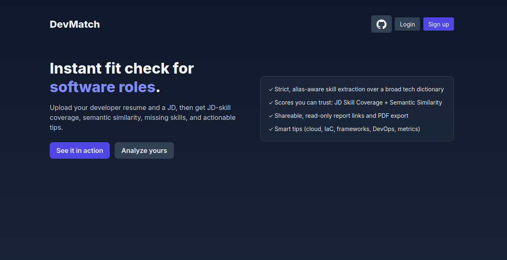
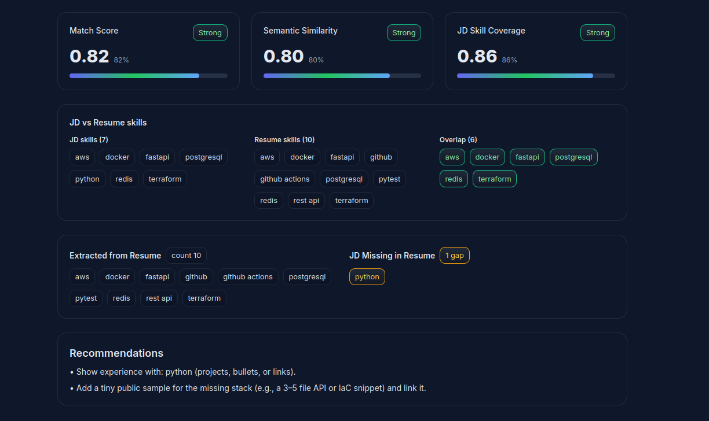

<h1>DevMatch</h1>

<strong>DevMatch</strong> is a lightweight web application that helps developers instantly check how well their resumes align with software engineering job descriptions. Upload a PDF resume and a JD, and DevMatch will extract skills, compute semantic similarity, and highlight gaps—giving you actionable insights within seconds.

This is the <strong>first launch</strong> of the project. I’m an independent developer building DevMatch. Future updates are already planned and will gradually improve performance, accuracy, and usability.

<h2>✨ Features</h2>
<ul>
  <li><strong>Skill extraction</strong> – Alias-aware, strict skill matching over a curated tech dictionary.</li>
  <li><strong>Semantic similarity</strong> – Uses transformer embeddings to compare resumes against job descriptions.</li>
  <li><strong>Match scoring</strong> – Blended metric (semantic similarity + skill overlap) with easy-to-read labels (Weak / Medium / Strong).</li>
  <li><strong>Actionable recommendations</strong> – Highlights missing skills and suggests practical resume improvements.</li>
  <li><strong>Reports</strong> – Shareable public report links and downloadable PDF exports.</li>
  <li><strong>Daily limits</strong> – Anonymous users: 3 free analyses/day. Logged-in users: up to 15/day.</li>
  <li><strong>Auth options</strong> – Sign up with email/password or log in via GitHub OAuth.</li>
</ul>

<h2>🖥️ Screenshots</h2>
<h3>Landing Page</h3>

<h3>Analysis Report</h3>

<h2>🛠️ Tech Stack</h2>
<ul>
  <li><strong>Backend</strong>: FastAPI, SQLAlchemy, Alembic</li>
  <li><strong>Frontend</strong>: TailwindCSS + Jinja2 templates</li>
  <li><strong>NLP</strong>: spaCy, Sentence Transformers</li>
  <li><strong>Database</strong>: SQLite (dev) / PostgreSQL (prod)</li>
  <li><strong>Auth</strong>: Email/password + GitHub OAuth</li>
</ul>

<h2>📦 Project Structure</h2>
<pre><code>resume-match-api/
├── app/
│   ├── core/
│   │   ├── config.py
│   │   └── security.py
│   │
│   ├── db/
│   │   ├── models.py
│   │   └── session.py
│   │
│   ├── middleware/
│   │   └── rate_limit.py
│   │
│   ├── schemas/
│   │   └── base.py
│   │
│   ├── routes/
│   │   ├── analyze.py
│   │   ├── auth.py
│   │   ├── health.py
│   │   ├── jobs.py
│   │   ├── match.py
│   │   ├── resumes.py
│   │   └── ui.py
│   │
│   ├── services/
│   │   ├── analyze_service.py
│   │   ├── match_service.py
│   │   └── report_service.py
│   │
│   ├── nlp/
│   │   ├── embeddings.py
│   │   ├── similarity.py
│   │   └── skills_extractor.py
│   │
│   ├── utils/
│   │   ├── metrics.py
│   │   ├── passwords.py
│   │   ├── pdf.py
│   │   ├── pdf_report.py
│   │   ├── slug.py
│   │   └── timing.py
│   │
│   ├── templates/
│   │   ├── dashboard.html
│   │   ├── index.html
│   │   ├── landing.html
│   │   ├── login_password.html
│   │   └── signup.html
│   │
│   └── main.py
│
├── data/
|   └── skills.csv
├── requirements.txt
├── pytest.ini
├── docker-compose.yml
└── Dockerfile
</code></pre>

<h2>🌱 Roadmap</h2>
<ul>
  <li>Expanding the skills dictionary for broader coverage.</li>
  <li>More precise recommendations (e.g., based on role type).</li>
  <li>Multi-language resume support.</li>
  <li>API endpoints for integrations.</li>
  <li>Optional premium tier with higher limits.</li>
</ul>

<h2>🤝 Contributing</h2>

This project is currently a <strong>solo developer build</strong>. Feedback, issues, and suggestions are very welcome! Please open a GitHub Issue if you spot bugs or have ideas for improvement.

<h2>📄 License</h2>

MIT License. See <a href="LICENSE">LICENSE</a> for details.

<h2>🙌 A Note</h2>

I’m building DevMatch with the goal of making something useful for other developers. This is just the beginning, and I’ll keep improving it over time. Thanks for checking it out! 🚀

